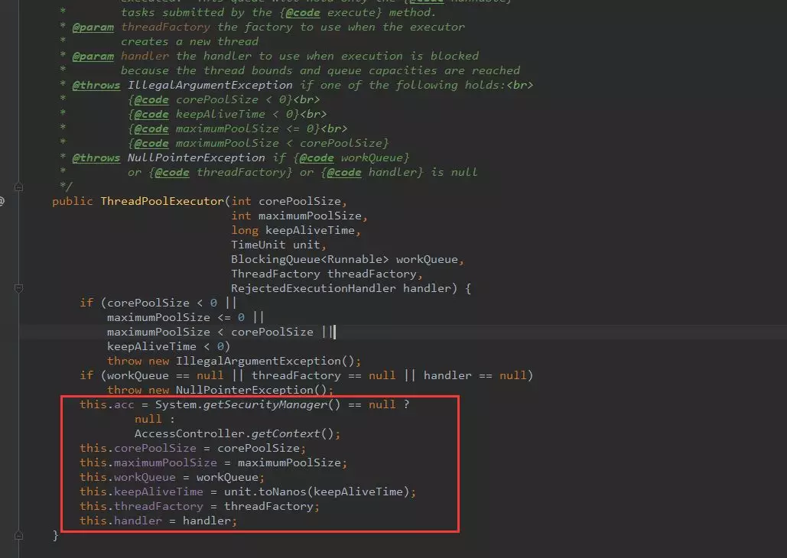
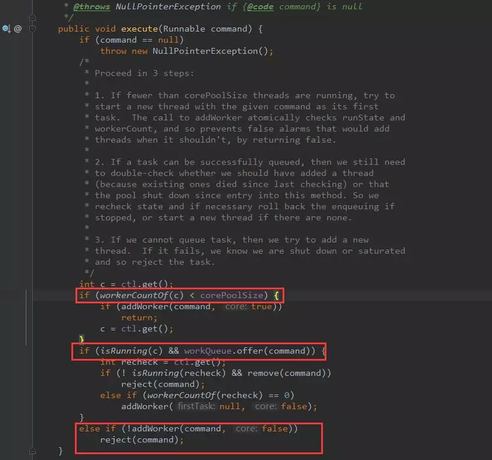
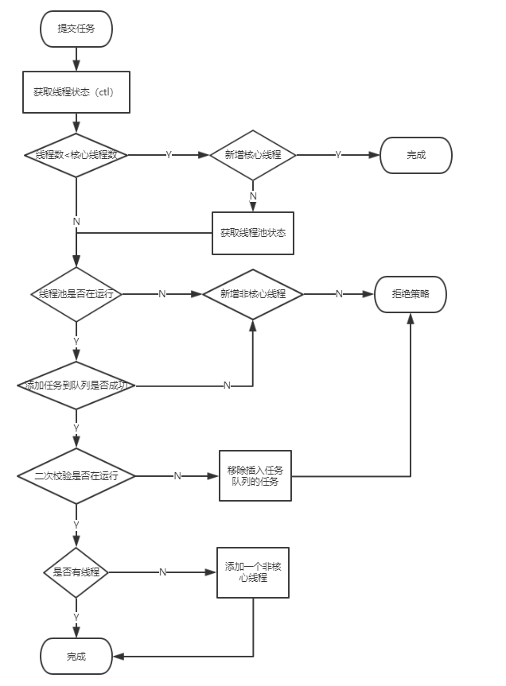
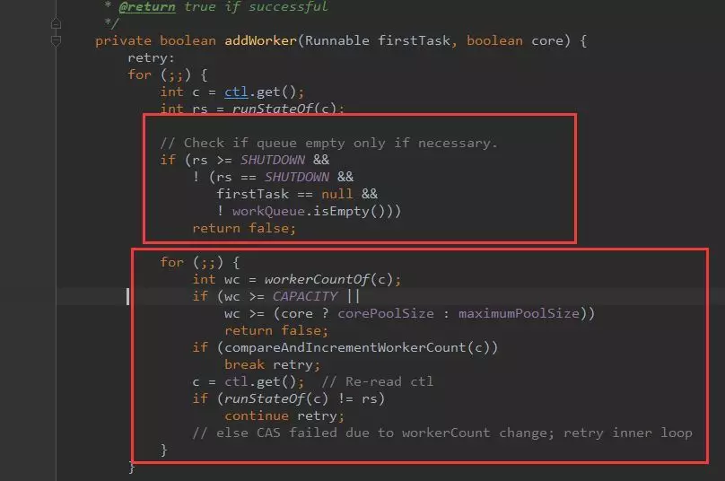
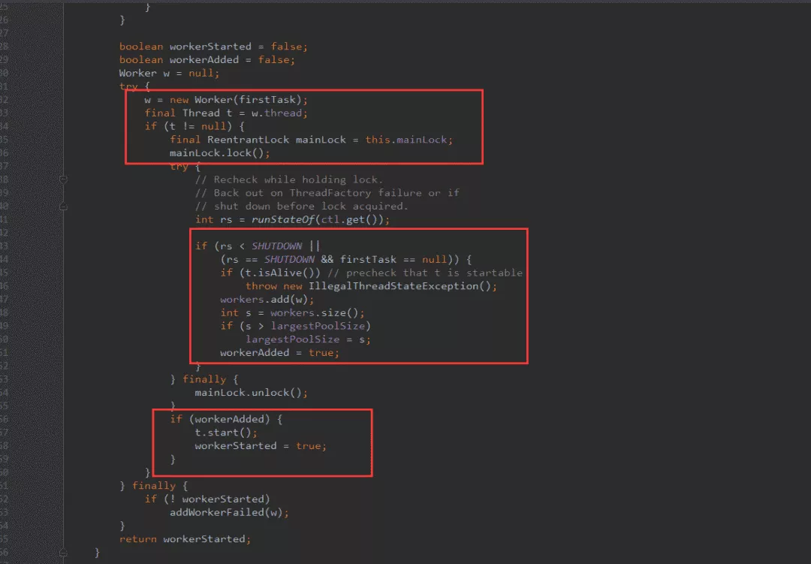
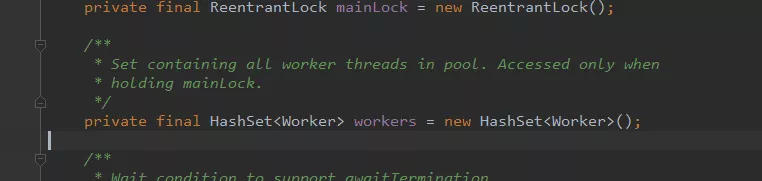
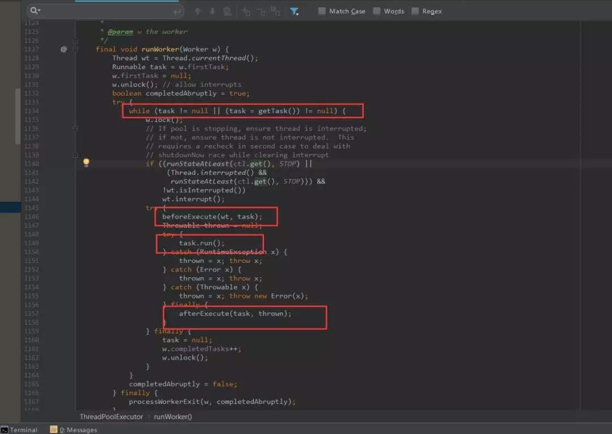
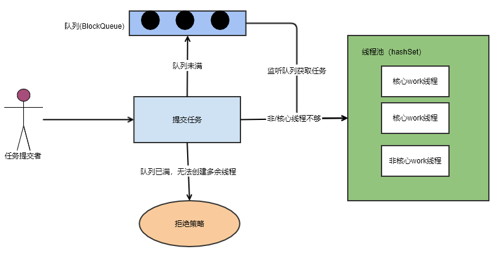

## 深入源码分析Java线程池的实现原理

程序的运行，其本质上，是对系统资源（CPU、内存、磁盘、网络等等）的使用。如何高效的使用这些资源是我们编程优化演进的一个方向。今天说的线程池就是一种对CPU利用的优化手段。

网上有不少介绍如何使用线程池的文章，那我想说点什么呢？我希望通过学习线程池原理，明白所有**池化技术**的基本设计思路。遇到其他相似问题可以解决。

#### 池化技术

前面提到一个名词——池化技术，那么到底什么是池化技术呢？

池化技术简单点来说，就是提前保存大量的资源，以备不时之需。在机器资源有限的情况下，使用池化技术可以大大的提高资源的利用率，提升性能等。

在编程领域，比较典型的池化技术有：

**线程池、连接池、内存池、对象池等**。

本文主要来介绍一下其中比较简单的线程池的实现原理，希望读者们可以举一反三，通过对线程池的理解，学习并掌握所有编程中池化技术的底层原理。

#### 创建一个线程

在Java的并发编程中，线程是十分重要的，在Java中，创建一个线程比较简单：

```java
public class App {
    public static void main(String[] args) throws Exception {
        new Thread(new Runnable() {
            @Override
            public void run() {
                System.out.println("线程运行中");
            }
        }).start();
    }
}
```

我们通过创建一个线程对象，并且实现Runnable接口就可以实现一个简单的线程。可以利用上多核CPU。当一个任务结束，当前线程就接收。

但很多时候，我们不止会执行一个任务。**如果每次都是如此的创建线程->执行任务->销毁线程，会造成很大的性能开销。**

那能否一个线程创建后，执行完一个任务后，又去执行另一个任务，而不是销毁。这就是线程池。

**这也就是池化技术的思想，通过预先创建好多个线程，放在池中，这样可以在需要使用线程的时候直接获取，避免多次重复创建、销毁带来的开销。**

#### 线程池的简单使用

以下代码，是在Java中创建线程池：

```
import java.util.concurrent.*;

public class App {
    public static void main(String[] args) throws Exception {
        ExecutorService executorService = new ThreadPoolExecutor(1, 1,
                60L, TimeUnit.SECONDS,
                new ArrayBlockingQueue<>(10));

        executorService.execute(new Runnable() {
            @Override
            public void run() {
                System.out.println("abcdefg");
            }
        });

        executorService.shutdown();
    }
}
```

Jdk提供给外部的接口也很简单。直接调用ThreadPoolExecutor构造一个就可以了，也可以通过Executors静态工厂构建，但一般不建议。

可以看到，开发者想要在代码中使用线程池还是比较简单的，这得益于Java给我们封装好的一系列API。但是，这些API的背后是什么呢，让我们来揭开这个迷雾，看清线程池的本质。

#### 线程池构造函数

通常，一般构造函数会反映出这个工具或这个对象的数据存储结构。



> 如果把线程池比作一个公司。公司会有正式员工处理正常业务，如果工作量大的话，会雇佣外包人员来工作。
>
> 闲时就可以释放外包人员以减少公司管理开销。一个公司因为成本关系，雇佣的人员始终是有最大数。
>
> 如果这时候还有任务处理不过来，就走需求池排任务。

- acc : 获取调用上下文

- corePoolSize: 核心线程数量，可以类比正式员工数量，常驻线程数量。

- maximumPoolSize: 最大的线程数量，公司最多雇佣员工数量。常驻+临时线程数量。

- workQueue：多余任务等待队列，再多的人都处理不过来了，需要等着，在这个地方等

  - ArrayBlockingQueue：基于数组结构的有界阻塞队列，FIFO。[【死磕Java并发】—-J.U.C之阻塞队列：ArrayBlockingQueue](http://cmsblogs.com/?p=2381)
  - LinkedBlockingQueue：基于链表结构的有界阻塞队列，FIFO。
  - SynchronousQueue：不存储元素的阻塞队列，每个插入操作都必须等待一个移出操作，反之亦然。[【死磕Java并发】—-J.U.C之阻塞队列：SynchronousQueue](http://cmsblogs.com/?p=2418)
  - PriorityBlockingQueue：具有优先界别的阻塞队列。[【死磕Java并发】—-J.U.C之阻塞队列：PriorityBlockingQueue](http://cmsblogs.com/?p=2407)

- keepAliveTime：非核心线程空闲时间，就是外包人员等了多久，如果还没有活干，解雇了。

- threadFactory: 创建线程的工厂，在这个地方可以统一处理创建的线程的属性。每个公司对员工的要求不一样，恩，在这里设置员工的属性。

- handler：线程池拒绝策略，什么意思呢？就是当任务实在是太多，人也不够，需求池也排满了，还有任务咋办？默认是不处理，抛出异常告诉任务提交者，我这忙不过来了。RejectedExecutionHandler，线程池的拒绝策略。所谓拒绝策略，是指将任务添加到线程池中时，线程池拒绝该任务所采取的相应策略。当向线程池中提交任务时，如果此时线程池中的线程已经饱和了，而且阻塞队列也已经满了，则线程池会选择一种拒绝策略来处理该任务。

  线程池提供了四种拒绝策略：

  1. AbortPolicy：直接抛出异常，默认策略；
  2. CallerRunsPolicy：用调用者所在的线程来执行任务；
  3. DiscardOldestPolicy：丢弃阻塞队列中靠最前的任务，并执行当前任务；
  4. DiscardPolicy：直接丢弃任务；
     当然我们也可以实现自己的拒绝策略，例如记录日志等等，实现RejectedExecutionHandler接口即可。

#### 添加一个任务

接着，我们看一下线程池中比较重要的execute方法，该方法用于向线程池中添加一个任务。



核心模块用红框标记了。

- 第一个红框：workerCountOf方法根据ctl的低29位，得到线程池的当前线程数，如果线程数小于corePoolSize，则执行addWorker方法创建新的线程执行任务；
- 第二个红框：判断线程池是否在运行，如果在，任务队列是否允许插入，插入成功再次验证线程池是否运行，如果不在运行，移除插入的任务，然后抛出拒绝策略。如果在运行，没有线程了，就启用一个线程。
- 第三个红框：如果添加非核心线程失败，就直接拒绝了。

这里逻辑稍微有点复杂，画了个流程图仅供参考



接下来，我们看看如何添加一个工作线程的？

#### 添加worker线程

从方法execute的实现可以看出：addWorker主要负责创建新的线程并执行任务，代码如下（这里代码有点长，没关系，也是分块的，总共有5个关键的代码块）：




- 第一个红框：做是否能够添加工作线程条件过滤：

- - 判断线程池的状态，如果线程池的状态值大于或等SHUTDOWN，则不处理提交的任务，直接返回；

- 第二个红框：做自旋，更新创建线程数量：

- - 通过参数core判断当前需要创建的线程是否为核心线程，如果core为true，且当前线程数大于corePoolSize，则跳出循环，开始创建新的线程

> 有人或许会疑问 retry 是什么？这个是java中的goto语法。只能运用在break和continue后面。

接着看后面的代码：




- 第一个红框：获取线程池主锁。

- - 线程池的工作线程通过Woker类实现，通过ReentrantLock锁保证线程安全。

- 第二个红框：添加线程到workers中（线程池中）。

- 第三个红框：启动新建的线程。


接下来，我们看看workers是什么。



一个hashSet。所以，线程池底层的存储结构其实就是一个HashSet。

#### worker线程处理队列任务



- 第一个红框：是否是第一次执行任务，或者从队列中可以获取到任务。
- 第二个红框：获取到任务后，执行任务开始前操作钩子。
- 第三个红框：执行任务。
- 第四个红框：执行任务后钩子。

这两个钩子（beforeExecute，afterExecute）允许我们自己继承线程池，做任务执行前后处理。

到这里，源代码分析到此为止。接下来做一下简单的总结。

#### 总结

所谓线程池本质是一个hashSet。多余的任务会放在阻塞队列中。

只有当阻塞队列满了后，才会触发非核心线程的创建。所以非核心线程只是临时过来打杂的。直到空闲了，然后自己关闭了。

线程池提供了两个钩子（beforeExecute，afterExecute）给我们，我们继承线程池，在执行任务前后做一些事情。

线程池原理关键技术：锁（lock,cas）、阻塞队列、hashSet（资源池）



最后希望对你理解线程池有帮助。最后，留一个思考题，为什么线程池的底层数据接口采用HashSet来实现？