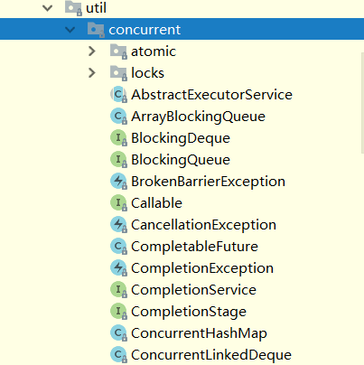
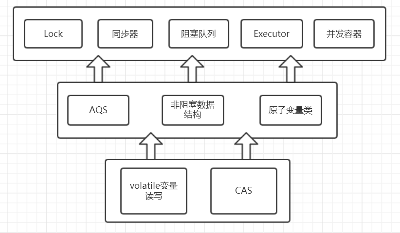
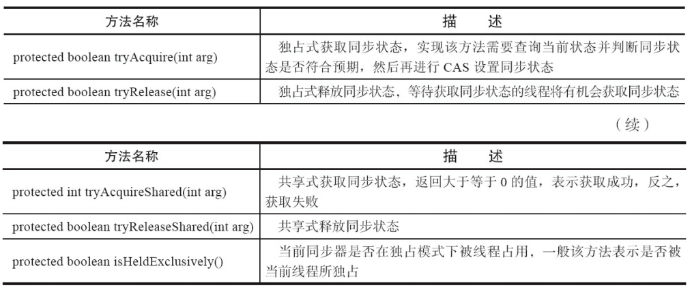
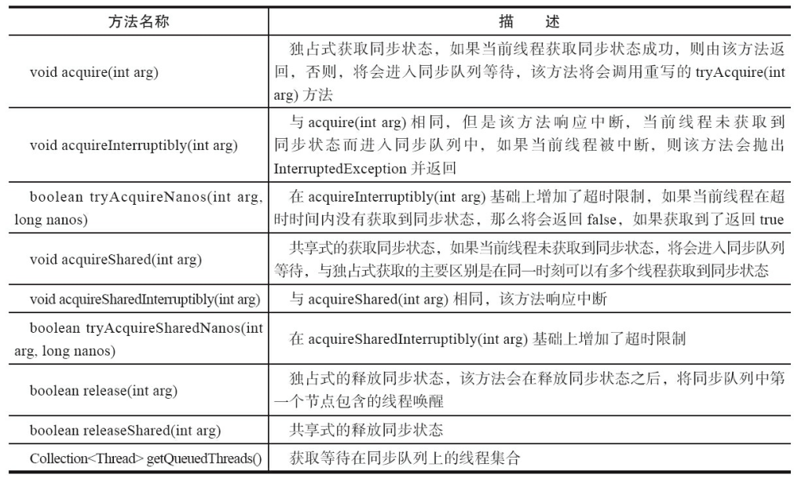

##### 初识`Lock`与`AbstractQueuedSynchronizer`(AQS)

#### 1. `concurrent`包的结构层次

在针对并发编程中，Doug Lea大师为我们提供了大量实用，高性能的工具类，针对这些代码进行研究会让我们队并发编程的掌握更加透彻也会大大提升我们队并发编程技术的热爱。这些代码在java.util.concurrent包下。如下图，即为concurrent包的目录结构图。 

 

其中包含了两个子包：atomic以及lock，另外在concurrent下的阻塞队列以及executors,这些就是concurrent包中的精华。从整体上来看concurrent包的整体实现图如下图所示： 

 

#### 2. `lock`简介

我们下来看concurent包下的lock子包。锁是用来控制多个线程访问共享资源的方式，一般来说，一个锁能够防止多个线程同时访问共享资源。在Lock接口出现之前，java程序主要是靠synchronized关键字实现锁功能的，而java SE5之后，并发包中增加了lock接口，它提供了与synchronized一样的锁功能。**虽然它失去了像`synchronized`关键字隐式加锁解锁的便捷性，但是却拥有了锁获取和释放的可操作性，可中断的获取锁以及超时获取锁等多种`synchronized`关键字所不具备的同步特性。**通常显示使用lock的形式如下：

~~~java
Lock lock = new ReentrantLock();
lock.lock();
try{
	.......
}finally{
	lock.unlock();
}
~~~

需要注意的是**synchronized同步块执行完成或者遇到异常是锁会自动释放，而lock必须调用unlock()方法释放锁，因此在finally块中释放锁**。

##### 2.1 `Lock`接口API

`lock`接口定义了哪些方法：

~~~java
//获取锁
void lock(); 
//获取锁的过程能够响应中断
void lockInterruptibly() throws InterruptedException；
//非阻塞式响应中断能立即返回，获取锁放回true,否则返回fasle
boolean tryLock();
//超时获取锁，在超时内或者未中断的情况下能够获取锁
boolean tryLock(long time, TimeUnit unit) throws InterruptedException;
//获取与lock绑定的等待通知组件，当前线程必须获得了锁才能进行等待，进行等待时会先释放锁，当再次获取锁时才能从等待中返回	
Condition newCondition();
~~~

上面是`lock`接口下的五个方法，也只是从源码中英译中翻译了一遍，感兴趣的可以自己的去看看。那么在locks包下有哪些类实现了该接口了？先从最熟悉的`ReentrantLock`说起。

> public class ReentrantLock implements **Lock**, java.io.Serializable

很显然`ReentrantLock`实现了`lock`接口，接下来我们来仔细研究一下它是怎样实现的。当你查看源码时你会惊讶的发现`ReentrantLock`并没有多少代码，另外有一个很明显的特点是：**基本上所有的方法的实现实际上都是调用了其静态内存类`Sync`中的方法，而Sync类继承了`AbstractQueuedSynchronizer（AQS）`**。可以看出要想理解`ReentrantLock`关键核心在于对队列同步器`AbstractQueuedSynchronizer`（简称同步器）的理解。

##### 2.2 初识AQS

关于AQS在源码中有十分具体的解释 ,大概意思是：

同步器是用来构建锁和其他同步组件的基础框架，它的实现主要依赖一个int成员变量来表示同步状态以及通过一个FIFO队列构成等待队列。它的**子类必须重写AQS的几个protected修饰的用来改变同步状态的方法**，其他方法主要是实现了排队和阻塞机制。**状态的更新使用getState,setState以及compareAndSetState这三个方法**。

子类被**推荐定义为自定义同步组件的静态内部类**，同步器自身没有实现任何同步接口，它仅仅是定义了若干同步状态的获取和释放方法来供自定义同步组件的使用，同步器既支持独占式获取同步状态，也可以支持共享式获取同步状态，这样就可以方便的实现不同类型的同步组件。

同步器是实现锁（也可以是任意同步组件）的关键，在锁的实现中聚合同步器，利用同步器实现锁的语义。可以这样理解二者的关系：**锁是面向使用者，它定义了使用者与锁交互的接口，隐藏了实现细节；同步器是面向锁的实现者，它简化了锁的实现方式，屏蔽了同步状态的管理，线程的排队，等待和唤醒等底层操作**。锁和同步器很好的隔离了使用者和实现者所需关注的领域。

##### 2.3 AQS的模板方法设计模式  

AQS的设计是使用模板方法设计模式，它将**一些方法开放给子类进行重写，而同步器给同步组件所提供模板方法又会重新调用被子类所重写的方法**。举个例子，AQS中需要重写的方法tryAcquire：

~~~java
protected boolean tryAcquire(int arg) {
	throw new UnsupportedOperationException();
}

~~~

`ReentrantLock`中`NonfairSync`（继承AQS）会重写该方法为：

~~~java
protected final boolean tryAcquire(int acquires) {
	return nonfairTryAcquire(acquires);
}

~~~

而AQS中的模板方法acquire():

~~~java
public final void acquire(int arg) {
    if (!tryAcquire(arg) &&
        acquireQueued(addWaiter(Node.EXCLUSIVE), arg))
        selfInterrupt();
}
~~~

会调用`tryAcquire`方法，而此时当继承AQS的`NonfairSync`调用模板方法`acquire`时就会调用已经被`NonfairSync`重写的`tryAcquire`方法。这就是使用AQS的方式，在弄懂这点后会lock的实现理解有很大的提升。可以归纳总结为这么几点：

1. 同步组件（这里不仅仅指锁，还包括`CountDownLatch`等）的实现依赖于同步器AQS，在同步组件实现中，使用AQS的方式被推荐定义继承AQS的静态内存类；
2. AQS采用模板方法进行设计，AQS的protected修饰的方法需要由继承AQS的子类进行重写实现，当调用AQS的子类的方法时就会调用被重写的方法；
3. AQS负责同步状态的管理，线程的排队，等待和唤醒这些底层操作，而Lock等同步组件主要专注于实现同步语义；
4. 在重写AQS的方式时，使用AQS提供的`getState(),setState(),compareAndSetState()`方法进行修改同步状态

AQS可重写的方法如下图（摘自《java并发编程的艺术》一书）：在实现同步组件时AQS提供的模板方法如下图：

AQS提供的模板方法可以分为3类：

1. 独占式获取与释放同步状态；
2. 共享式获取与释放同步状态；
3. 查询同步队列中等待线程情况；

同步组件通过AQS提供的模板方法实现自己的同步语义。

