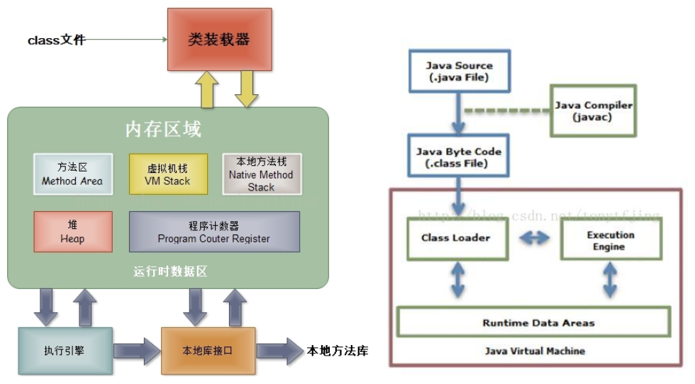
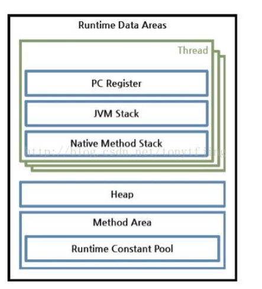
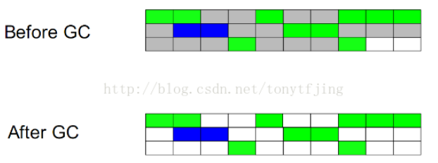
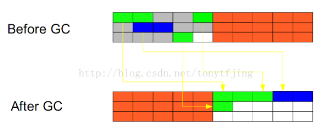
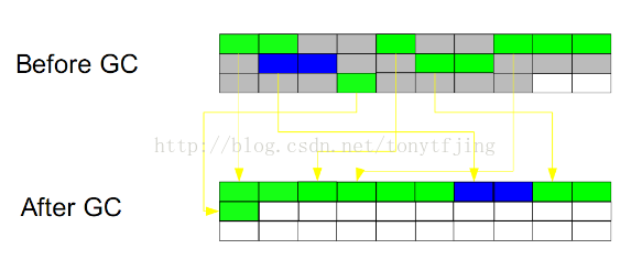
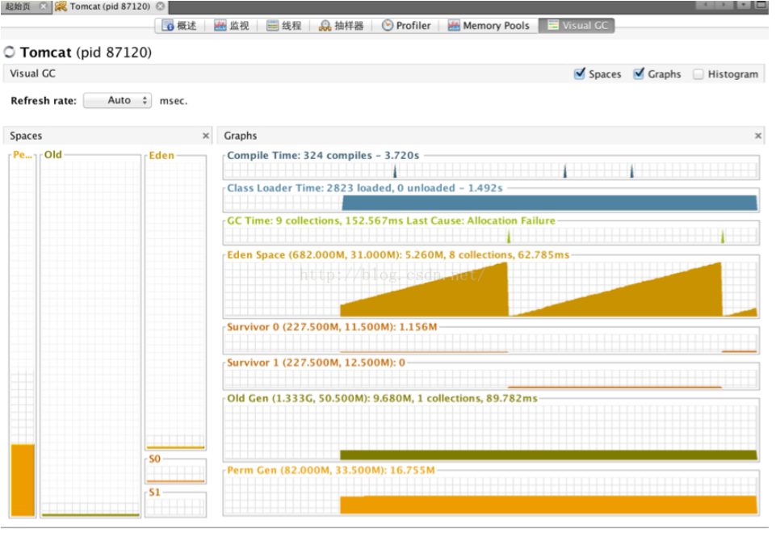
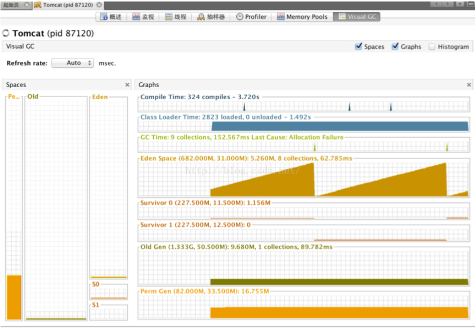
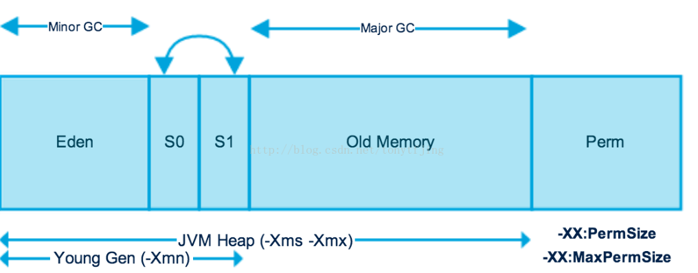

**JVM结构、内存分配、垃圾回收算法、垃圾收集器**。下面我们一一来看。

### 一、JVM结构

根据《java虚拟机规范》规定，JVM的基本结构一般如下图所示：

从左图可知，JVM主要包括四个部分：

**1.类加载器（ClassLoader）**:在JVM启动时或者在类运行时将需要的class加载到JVM中。（右图表示了从java源文件到JVM的整个过程，可配合理解。 关于类的加载机制，可以参考[虚拟机类加载机制.md](./虚拟机类加载机制.md)

**2.执行引擎：**负责执行class文件中包含的字节码指令（执行引擎的工作机制，这里也不细说了，这里主要介绍JVM结构）；

**3.内存区（也叫运行时数据区）：**是在JVM运行的时候操作所分配的内存区。运行时内存区主要可以划分为5个区域，如图：

- 方法区(Method Area)：用于存储类结构信息的地方，包括常量池、静态变量、构造函数等。虽然JVM规范把方法区描述为堆的一个逻辑部分， 但它却有个别名non-heap（非堆），所以大家不要搞混淆了。方法区还包含一个运行时常量池。

- java堆(Heap)：存储java实例或者对象的地方。这块是GC的主要区域（后面解释）。从存储的内容我们可以很容易知道，方法区和堆是被所有java线程共享的。

- java栈(Stack)：java栈总是和线程关联在一起，每当创建一个线程时，JVM就会为这个线程创建一个对应的java栈。在这个java栈中又会包含多个栈帧，每运行一个方法就创建一个栈帧，用于存储局部变量表、操作栈、方法返回值等。每一个方法从调用直至执行完成的过程，就对应一个栈帧在java栈中入栈到出栈的过程。所以java栈是现成私有的。

- 程序计数器(PC Register)：用于保存当前线程执行的内存地址。由于JVM程序是多线程执行的（线程轮流切换），所以为了保证线程切换回来后，还能恢复到原先状态，就需要一个独立的计数器，记录之前中断的地方，可见程序计数器也是线程私有的。

- 本地方法栈(Native Method Stack)：和java栈的作用差不多，只不过是为JVM使用到的native方法服务的。

4.本地方法接口：

主要是调用C或C++实现的本地方法及返回结果。

### 二、内存分配

我觉得了解垃圾回收之前，得先了解JVM是怎么分配内存的，然后识别哪些内存是垃圾需要回收，最后才是用什么方式回收。

Java的内存分配原理与C/C++不同，C/C++每次申请内存时都要malloc进行系统调用，而系统调用发生在内核空间，每次都要中断进行切换，这需要一定的开销，而Java虚拟机是先一次性分配一块较大的空间，然后每次new时都在该空间上进行分配和释放，减少了系统调用的次数，节省了一定的开销，这有点类似于内存池的概念；二是有了这块空间过后，如何进行分配和回收就跟GC机制有关了。

java一般内存申请有两种：**静态内存和动态内存**。很容易理解，编译时就能够确定的内存就是静态内存，即内存是固定的，系统一次性分配，比如int类型变量；动态内存分配就是在程序执行时才知道要分配的存储空间大小，比如java对象的内存空间。根据上面我们知道，java栈、程序计数器、本地方法栈都是线程私有的，线程生就生，线程灭就灭，栈中的栈帧随着方法的结束也会撤销，内存自然就跟着回收了。所以这几个区域的内存分配与回收是确定的，我们不需要管的。但是java堆和方法区则不一样，我们只有在程序运行期间才知道会创建哪些对象，所以这部分内存的分配和回收都是动态的。一般我们所说的垃圾回收也是针对的这一部分。

总之Stack的内存管理是顺序分配的，而且定长，不存在内存回收问题；而Heap 则是为java对象的实例随机分配内存，不定长度，所以存在内存分配和回收的问题；

### 三、垃圾检测、回收算法

垃圾收集器一般必须完成两件事：检测出垃圾；回收垃圾。怎么检测出垃圾？一般有以下几种方法：

引用计数法：给一个对象添加引用计数器，每当有个地方引用它，计数器就加1；引用失效就减1。

好了，问题来了，如果我有两个对象A和B，互相引用，除此之外，没有其他任何对象引用它们，实际上这两个对象已经无法访问，即是我们说的垃圾对象。但是互相引用，计数不为0，导致无法回收，所以还有另一种方法：

可达性分析算法：以根集对象为起始点进行搜索，如果有对象不可达的话，即是垃圾对象。这里的根集一般包括java栈中引用的对象、方法区常良池中引用的对象

本地方法中引用的对象等。

总之，JVM在做垃圾回收的时候，会检查堆中的所有对象是否会被这些根集对象引用，不能够被引用的对象就会被垃圾收集器回收。一般回收算法也有如下几种：

**1.标记-清除（Mark-sweep）**

算法和名字一样，分为两个阶段：标记和清除。标记所有需要回收的对象，然后统一回收。这是最基础的算法，后续的收集算法都是基于这个算法扩展的。

不足：效率低；标记清除之后会产生大量碎片。效果图如下：

**2.复制（Copying）**

此算法把内存空间划为两个相等的区域，每次只使用其中一个区域。垃圾回收时，遍历当前使用区域，把正在使用中的对象复制到另外一个区域中。此算法每次只处理正在使用中的对象，因此复制成本比较小，同时复制过去以后还能进行相应的内存整理，不会出现“碎片”问题。当然，此算法的缺点也是很明显的，就是需要两倍内存空间。效果图如下：

**3.标记-整理（Mark-Compact）**

此算法结合了“标记-清除”和“复制”两个算法的优点。也是分两阶段，第一阶段从根节点开始标记所有被引用对象，第二阶段遍历整个堆，把清除未标记对象并且把存活对象“压缩”到堆的其中一块，按顺序排放。此算法避免了“标记-清除”的碎片问题，同时也避免了“复制”算法的空间问题。效果图如下：

（1,2,3 图文摘自[ http://pengjiaheng.iteye.com/blog/520228](http://pengjiaheng.iteye.com/blog/520228)，感谢原作者。）

**4.分代收集算法**

这是当前商业虚拟机常用的垃圾收集算法。分代的垃圾回收策略，是基于这样一个事实：不同的对象的生命周期是不一样的。因此，不同生命周期的对象可以采取不同的收集方式，以便提高回收效率。

**为什么要运用分代垃圾回收策略？**在java程序运行的过程中，会产生大量的对象，因每个对象所能承担的职责不同所具有的功能不同所以也有着不一样的生命周期，有的对象生命周期较长，比如Http请求中的Session对象，线程，Socket连接等；有的对象生命周期较短，比如String对象，由于其不变类的特性，有的在使用一次后即可回收。试想，在不进行对象存活时间区分的情况下，每次垃圾回收都是对整个堆空间进行回收，那么消耗的时间相对会很长，而且对于存活时间较长的对象进行的扫描工作等都是徒劳。因此就需要引入分治的思想，所谓分治的思想就是因地制宜，将对象进行代的划分，把不同生命周期的对象放在不同的代上使用不同的垃圾回收方式。

**如何划分？**将对象按其生命周期的不同划分成：年轻代(Young Generation)、年老代(Old Generation)、持久代(Permanent Generation)。其中持久代主要存放的是类信息，所以与java对象的回收关系不大，与回收息息相关的是年轻代和年老代。这里有个比喻很形象

“假设你是一个普通的 Java 对象，你出生在 Eden 区，在 Eden 区有许多和你差不多的小兄弟、小姐妹，可以把 Eden 区当成幼儿园，在这个幼儿园里大家玩了很长时间。Eden 区不能无休止地放你们在里面，所以当年纪稍大，你就要被送到学校去上学，这里假设从小学到高中都称为 Survivor 区。开始的时候你在 Survivor 区里面划分出来的的“From”区，读到高年级了，就进了 Survivor 区的“To”区，中间由于学习成绩不稳定，还经常来回折腾。直到你 18 岁的时候，高中毕业了，该去社会上闯闯了。于是你就去了年老代，年老代里面人也很多。在年老代里，你生活了  20 年 (每次 GC 加一岁)，最后寿终正寝，被 GC 回收。有一点没有提，你在年老代遇到了一个同学，他的名字叫爱德华 (慕光之城里的帅哥吸血鬼)，他以及他的家族永远不会死，那么他们就生活在永生代。”

具体区域可以通过VisualVM中的VisaulGC插件查看，如图（openjdk 1.7）：

**年轻代：**是所有新对象产生的地方。年轻代被分为3个部分——Enden区和两个Survivor区（From和to）当Eden区被对象填满时，就会执行Minor GC。并把所有存活下来的对象转移到其中一个survivor区（假设为from区）。Minor GC同样会检查存活下来的对象，并把它们转移到另一个survivor区（假设为to区）。这样在一段时间内，总会有一个空的survivor区。经过多次GC周期后，仍然存活下来的对象会被转移到年老代内存空间。通常这是在年轻代有资格提升到年老代前通过设定年龄阈值来完成的。需要注意，Survivor的两个区是对称的，没先后关系，from和to是相对的。

**年老代：**在年轻代中经历了N次回收后仍然没有被清除的对象，就会被放到年老代中，可以说他们都是久经沙场而不亡的一代，都是生命周期较长的对象。对于年老代和永久代，就不能再采用像年轻代中那样搬移腾挪的回收算法，因为那些对于这些回收战场上的老兵来说是小儿科。通常会在老年代内存被占满时将会触发Full GC,回收整个堆内存。

**持久代：**用于存放静态文件，比如java类、方法等。持久代对垃圾回收没有显著的影响。 

分代回收的效果图如下：

我这里之所以最后讲分代，是因为分代里涉及了前面几种算法。年轻代：涉及了复制算法；年老代：涉及了“标记-整理（Mark-Sweep）”的算法。

### 四、垃圾收集器

垃圾收集算法是内存回收的方法论，而实现这些方法论的则是垃圾收集器。不同厂商不同版本JVM所提供的垃圾收集器可能不同，这里参照《深入理解Java虚拟机》说的是JDK1.7版本Hotspot虚拟机，关于垃圾收集器有篇博文总结的不错，我就不说了，详见：<http://blog.csdn.net/java2000_wl/article/details/8030172>

### 总结 

虽然我不认为学习java必须去了解Java底层的实现，但是我想如果你更加理解JVM和GC的话，你就会更加理解Java，在以后的学习和工作中绝对受益匪浅。毕竟我们的目标不是刷墙工，不是搬运工，而是开发攻城狮啊！

  --------------------- 作者：tonytfjing  来源：CSDN  原文：https://blog.csdn.net/tonytfjing/article/details/44278233?utm_source=copy  版权声明：本文为博主原创文章，转载请附上博文链接！