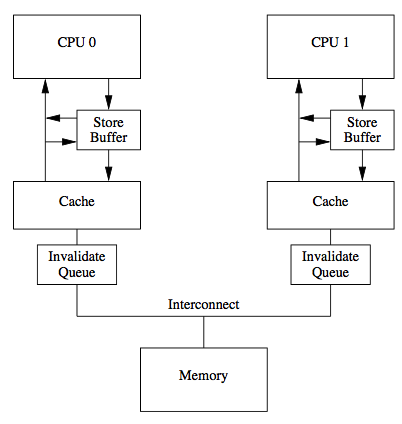

## 内存模型是怎么解决缓存一致性的？

此[文章](http://www.hollischuang.com/archives/2662)转载Hollis博客

在[再有人问你Java内存模型是什么，就把这篇文章发给他](http://www.hollischuang.com/archives/2550)这篇文章中，我们介绍过关于Java内存模型的来龙去脉。

我们在文章中提到过，由于CPU和主存的处理速度上存在一定差别，为了匹配这种差距，提升计算机能力，人们在CPU和主存之间增加了多层高速缓存。每个CPU会有L1、L2甚至L3缓存，在多核计算机中会有多个CPU，那么就会存在多套缓存，那么这多套缓存之间的数据就可能出现不一致的现象。为了解决这个问题，有了内存模型。内存模型定义了共享内存系统中多线程程序读写操作行为的规范。通过这些规则来规范对内存的读写操作，从而保证指令执行的正确性。

不知道小伙伴们有没有想过这样的问题：**内存模型到底是怎么保证缓存一致性的呢？**

接下来我们试着回答这个问题。首先，缓存一致性是由于引入缓存而导致的问题，所以，这是很多CPU厂商必须解决的问题。为了解决前面提到的缓存数据不一致的问题，人们提出过很多方案，通常来说有以下2种方案：

> 1、通过在总线加`LOCK#`锁的方式。
>
> 2、通过缓存一致性协议（Cache Coherence Protocol）。

在早期的CPU当中，是通过在总线上加`LOCK#`锁的形式来解决缓存不一致的问题。因为CPU和其他部件进行通信都是通过总线来进行的，如果对总线加`LOCK#`锁的话，也就是说阻塞了其他CPU对其他部件访问（如内存），从而使得只能有一个CPU能使用这个变量的内存。在总线上发出了`LCOK#`锁的信号，那么只有等待这段代码完全执行完毕之后，其他CPU才能从其内存读取变量，然后进行相应的操作。这样就解决了缓存不一致的问题。

但是由于在锁住总线期间，其他CPU无法访问内存，会导致效率低下。因此出现了第二种解决方案，通过缓存一致性协议来解决缓存一致性问题。

### 缓存一致性协议

缓存一致性协议（Cache Coherence Protocol），最出名的就是Intel 的MESI协议，MESI协议保证了每个缓存中使用的共享变量的副本是一致的。

MESI的核心的思想是：当CPU写数据时，如果发现操作的变量是共享变量，即在其他CPU中也存在该变量的副本，会发出信号通知其他CPU将该变量的缓存行置为无效状态，因此当其他CPU需要读取这个变量时，发现自己缓存中缓存该变量的缓存行是无效的，那么它就会从内存重新读取。

在MESI协议中，每个缓存可能有4个状态，它们分别是：

> **M(Modified)**：这行数据有效，数据被修改了，和内存中的数据不一致，数据只存在于本Cache中。
>
> **E(Exclusive)**：这行数据有效，数据和内存中的数据一致，数据只存在于本Cache中。
>
> **S(Shared)**：这行数据有效，数据和内存中的数据一致，数据存在于很多Cache中。
>
> **I(Invalid)**：这行数据无效。

关于MESI的更多细节这里就不详细介绍了，只要知道，MESI是一种比较常用的缓存一致性协议，他可以用来解决缓存之间的数据一致性问题就可以了。

但是，值得注意的是，传统的MESI协议中有两个行为的执行成本比较大。

一个是将某个Cache Line标记为Invalid状态，另一个是当某Cache Line当前状态为Invalid时写入新的数据。所以CPU通过Store Buffer和Invalidate Queue组件来降低这类操作的延时。

如图：

 


当一个CPU进行写入时，首先会给其它CPU发送Invalid消息，然后把当前写入的数据写入到Store Buffer中。然后异步在**某个时刻**真正的写入到Cache中。

当前CPU核如果要读Cache中的数据，需要先扫描Store Buffer之后再读取Cache。

但是此时其它CPU核是看不到当前核的Store Buffer中的数据的，要等到Store Buffer中的数据被刷到了Cache之后才会触发失效操作。

而当一个CPU核收到Invalid消息时，会把消息写入自身的Invalidate Queue中，随后**异步**将其设为Invalid状态。

和Store Buffer不同的是，当前CPU核心使用Cache时并不扫描Invalidate Queue部分，所以可能会**有极短时间的脏读问题**。

所以，为了解决缓存的一致性问题，比较典型的方案是MESI缓存一致性协议。

**MESI协议，可以保证缓存的一致性，但是无法保证实时性。**

### 内存模型

前面介绍过了缓存一致性模型，接着我们再来看一下内存模型。我们说过内存模型定义一系列规范，来保证多线程访问共享变量时的可见性、有序性和原子性。（更多内容请参考[再有人问你Java内存模型是什么，就把这篇文章发给他](http://www.hollischuang.com/archives/2550)）

内存模型（Memory Model）如果扩展开来说的话，通常指的是内存一致性模型（Memory Sequential Consistency Model）

前面我们提到过缓存一致性，这里又要说内存一致性，不是故意要把读者搞蒙，而是希望通过对比让读者更加清楚。

缓存一致性（Cache Coherence），解决是多个缓存副本之间的数据的一致性问题。

内存一致性（Memory Consistency），保证的是多线程程序访问内存时可以读到什么值。

我们首先看以下程序：

```
初始：x=0 y=0

Thread1：
S1：x=1
L1：r1=y

Thread2：
S2：y=2
L2：r2=x
```

其中，S1、S2、L1、L2是语句代号（S表示Store，L表示Load）；r1和r2是两个寄存器。x和y是两个不同的内存变量。两个线程执行完之后，r1和r2可能是什么值？

注意到线程是并发、交替执行的，下面是可能的执行顺序和相应结果：

```
S1 L1 S2 L2 那么r1=0 r2=2

S1 S2 L1 L2 那么r1=2 r2=1

S2 L2 S1 L1 那么r1=2 r2=0
```

这些都是意料之内、情理之中的。但是在x86体系结构下，很可能得到r1=0 r2=0这样的结果。

如果没有`Memory Consistency`，程序员写的程序代码的输出结果是不确定的。

因此，`Memory Consistency`就是程序员（编程语言）、编译器、CPU间的一种协议。这个协议保证了程序访问内存时会得到什么值。

简单点说，内存一致性，就是保证并发场景下的程序运行结果和程序员预期是一样的（当然，要通过加锁等方式），包括的就是并发编程中的原子性、有序性和可见性。而**缓存一致性说的就是并发编程中的可见性**。

**在很多内存模型的实现中，关于缓存一致性的保证都是通过硬件层面缓存一致性协议来保证的。**需要注意的是，这里提到的内存模型，是计算机内存模型，而非Java内存模型。

### 总结

**缓存一致性问题**。硬件层面的问题，指的是由于多核计算机中有多套缓存，各个缓存之间的数据不一致性问题。

PS：这里还需要再重复一遍，Java多线程中，每个线程都有自己的工作内存，需要和主存进行交互。这里的工作内存和计算机硬件的缓存并不是一回事儿，只是可以相互类比。所以，并发编程的可见性问题，是因为各个线程之间的本地内存数据不一致导致的，和计算机缓存并无关系。

**缓存一致性协议**。用来解决缓存一致性问题的，常用的是MESI协议。

**内存一致性模型**。屏蔽计算机硬件问题，主要来解决并发编程中的原子性、有序性和一致性问题。

**实现内存一致性模型的时候可能会用到缓存一致性模型。**

### 思考

最后，再给大家留一道思考题：

既然在硬件层面，已经有了缓存一致性协议，可以保证缓存的一致性即并发编程中的可见性，那么为什么在写多线程的代码的时候，程序员要自己使用volatile、synchronized等关键字来保证可见性？