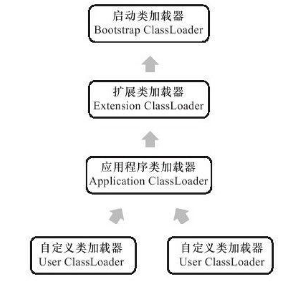

### 虚拟机类加载机制

#### 概述

虚拟机把描述类的数据从Class文件加载到内存，并对数据进行校验、转换解析和初始
化，最终形成可以被虚拟机直接使用的Java类型，这就是虚拟机的类加载机制。

#### 类加载的时机

类从被加载到虚拟机内存中开始，到卸载出内存为止，它的整个生命周期包括：加载（Loading）、验证（Verification）、准备（Preparation）、解析（Resolution）、初始化（Initialization）、使用（Using）和卸载（Unloading）7个阶段。其中验证、准备、解析3个部分统称为连接（Linking）

什么情况下需要开始类加载过程的第一个阶段：加载？Java虚拟机规范中并没有进行强制约束，这点可以交给虚拟机的具体实现来自由把握。但是对于初始化阶段，虚拟机规范则是严格规定了有且只有5种情况必须立即对类进行“初始化”（而加载、验证、准备自然需要在此之前开始）：

1）遇到`new`、`getstatic`、`putstatic`或`invokestatic`这4条字节码指令时，如果类没有进行过初始化，则需要先触发其初始化。生成这4条指令的最常见的Java代码场景是：使用`new`关键字实例化对象的时候、读取或设置一个类的静态字段（被final修饰、已在编译期把结果放入常量池的静态字段除外）的时候，以及调用一个类的静态方法的时候。
2）使用`java.lang.reflect`包的方法对类进行反射调用的时候，如果类没有进行过初始化，则需要先触发其初始化。
3）当初始化一个类的时候，如果发现其父类还没有进行过初始化，则需要先触发其父类的初始化。
4）当虚拟机启动时，用户需要指定一个要执行的主类（包含main（）方法的那个类），虚拟机会先初始化这个主类。
5）当使用JDK 1.7的动态语言支持时，如果一个`java.lang.invoke.MethodHandle`实例最后的解析结果`REF_getStatic`、`REF_putStatic`、`REF_invokeStatic`的方法句柄，并且这个方法句柄所对应的类没有进行过初始化，则需要先触发其初始化。

#### 类加载的过程

##### 加载

类加载的第一个阶段，需要完成三件事情：

1）通过一个类的全限定名来获取定义此类的二进制字节流。
2）将这个字节流所代表的静态存储结构转化为方法区的运行时数据结构。
3）在内存中生成一个代表这个类的`java.lang.Class`对象，作为方法区这个类的各种数据的访问入口

加载阶段完成后，虚拟机外部的二进制字节流就按照虚拟机所需的格式存储在方法区之中，方法区中的数据存储格式由虚拟机实现自行定义，虚拟机规范未规定此区域的具体数据结构。然后在内存中实例化一个`java.lang.Class`类的对象（并没有明确规定是在Java堆中，对于`HotSpot`虚拟机而言，`Class`对象比较特殊，它虽然是对象，但是存放在方法区里面），这个对象将作为程序访问方法区中的这些类型数据的外部接口。

##### 验证

验证是连接阶段的第一步，这一阶段的目的是为了确保Class文件的字节流中包含的信息符合当前虚拟机的要求，并且不会危害虚拟机自身的安全。

从整体上看，验证阶段大致上会完成下面4个阶段的检验动作：文件格式验证、元数据验证、字节码验证、符号引用验证

如果我们的程序经过反复验证没有问题后，可以通过用`-Xverify：none`来关闭验证，节省验证所花费时间

##### 准备

准备阶段是正式为类变量分配内存并设置类变量初始值的阶段，这些变量所使用的内存都将在方法区中进行分配。这个阶段中有两个容易产生混淆的概念需要强调一下，首先，这时候进行内存分配的仅包括类变量（被static修饰的变量），而不包括实例变量，实例变量将会在对象实例化时随着对象一起分配在Java堆中。其次，这里所说的初始值“通常情况”下是数据类型的零值，假设一个类变量的定义为：

~~~java
 public static int value=123；
~~~

那变量value在准备阶段过后的初始值为0而不是123，因为这时候尚未开始执行任何Java方法，而把value赋值为123的`putstatic`指令是程序被编译后，存放于类构造器`＜clinit＞（）`方法之中，所以把value赋值为123的动作将在初始化阶段才会执行

##### 解析

解析阶段是虚拟机将常量池内的符号引用替换为直接引用的过程

##### 初始化

类初始化阶段是类加载过程的最后一步，前面的类加载过程中，除了在加载阶段用户应用程序可以通过自定义类加载器参与之外，其余动作完全由虚拟机主导和控制。到了初始化阶段，才真正开始执行类中定义的Java程序代码。

在准备阶段，变量已经赋过一次系统要求的初始值，而在初始化阶段，则根据程序员通过程序制定的主观计划去初始化类变量和其他资源，或者可以从另外一个角度来表达：初始化阶段是执行类构造器`＜clinit＞（）`方法的过程。

`＜clinit＞（）`方法是由编译器自动收集类中的所有类变量的赋值动作和静态语句块（static{}块）中的语句合并产生的，编译器收集的顺序是由语句在源文件中出现的顺序所决定的，静态语句块中只能访问到定义在静态语句块之前的变量，定义在它之后的变量，在前面的静态语句块可以赋值，但是不能访问。

`＜clinit＞（）`方法对于类或接口来说并不是必需的，如果一个类中没有静态语句块，也没有对变量的赋值作，那么编译器可以不为这个类生成`＜clinit＞（）`方法。
接口中不能使用静态语句块，但仍然有变量初始化的赋值操作，因此接口与类一样都会生成`＜clinit＞（）`方法。但接口与类不同的是，执行接口的`＜clinit＞（）`方法不需要先执行父接口的`＜clinit＞（）`方法。只有当父接口中定义的变量使用时，父接口才会初始化。另外，接口的实现类在初始化时也一样不会执行接口的`＜clinit＞（）`方法。

#### 类加载器

虚拟机设计团队把类加载阶段中的“通过一个类的全限定名来获取描述此类的二进制字节流”这个动作放到Java虚拟机外部去实现，以便让应用程序自己决定如何去获取所需要的类。实现这个动作的代码模块称为“类加载器”。

##### 类与类加载器

类加载器虽然只用于实现类的加载动作，但它在Java程序中起到的作用却远远不限于类加载阶段。对于任意一个类，都需要由加载它的类加载器和这个类本身一同确立其在Java虚拟机中的唯一性，每一个类加载器，都拥有一个独立的类名称空间。这句话可以表达得更通俗一些：比较两个类是否“相等”，只有在这两个类是由同一个类加载器加载的前提下才有意义，否则，即使这两个类来源于同一个Class文件，被同一个虚拟机加载，只要加载它们的类
加载器不同，那这两个类就必定不相等。
这里所指的“相等”，包括代表类的Class对象的`equals()`方法、`isAssignableFrom()`方法、`isInstance()`方法的返回结果，也包括使用`instanceof`关键字做对象所属关系判定等情况。如果没有注意到类加载器的影响，在某些情况下可能会产生具有迷惑性的结果。

##### 双亲委派模型

从Java虚拟机的角度来讲，只存在两种不同的类加载器：一种是启动类加载器（`Bootstrap ClassLoader`），这个类加载器使用C++语言实现[1]，是虚拟机自身的一部分；另一种就是所有其他的类加载器，这些类加载器都由Java语言实现，独立于虚拟机外部，并且全都继承自抽象类`java.lang.ClassLoader`。

类加载器还可以划分得更细致一些，主要是以下三种：

启动类加载器（`Bootstrap ClassLoader`）：这个类将器负责将存放在%JAVA_HOME%\lib目录中的，或者被-Xbootclasspath参数所指定的路径中的，并且是虚拟机识别的（仅按照文件名识别，如rt.jar，名字不符合的类库即使放在lib目录中也不会被加载）类库加载到虚拟机内存中。启动类加载器无法被Java程序直接引用，用户在编写自定义类加载器时，如果需要把加载请求委派给引导类加载器，那直接使用null代替即可

扩展类加载器（`Extension ClassLoader`）：这个加载器由`sun.misc.Launcher$ExtClassLoader`实现，它负责加载`%JAVA_HOME%\lib\ext`目录中的，或者被`java.ext.dirs`系统变量所指定的路径中的所有类库，开发者可以直接使用扩展类加载器。
应用程序类加载器（`Application ClassLoader`）：这个类加载器由`sun.misc.Launcher $AppClassLoader`实现。由于这个类加载器是`ClassLoader`中的`getSystemClassLoader()`方法的返回值，所以一般也称它为系统类加载器。它负责加载用户类路径（ClassPath）上所指定的类库，开发者可以直接使用这个类加载器，如果应用程序中没有自定义过自己的类加载器，一般情况下这个就是程序中默认的类加载器。

类加载双亲委派模型如下图：

双亲委派模型的工作过程是：如果一个类加载器收到了类加载的请求，它首先不会自己去尝试加载这个类，而是把这个请求委派给父类加载器去完成，每一个层次的类加载器都是如此，因此所有的加载请求最终都应该传送到顶层的启动类加载器中，只有当父加载器反馈自己无法完成这个加载请求（它的搜索范围中没有找到所需的类）时，子加载器才会尝试自己去加载。

##### 破坏双亲委派模型

spi, osgi等