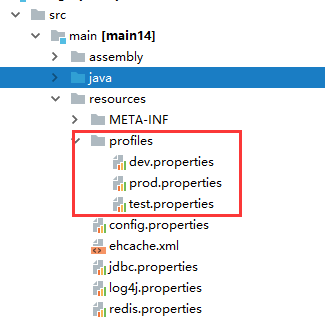

## maven profile用法

### 背景

在开发过程中，我们的软件会面对**不同的运行环境**，比如开发环境、测试环境、生产环境，而我们的软件在不同的环境中，有的配置可能会不一样，比如数据源配置、日志文件配置、以及一些软件运行过程中的基本配置，那每次我们将软件部署到不同的环境时，都需要修改相应的配置文件，这样来回修改，很容易出错，而且浪费劳动力。

maven提供了一种方便的解决这种问题的方案，就是profile功能。

### profile简介

profile可以让我们定义一系列的配置信息，然后指定其激活条件。这样我们就可以定义多个profile，然后每个profile对应不同的激活条件和配置信息，从而达到不同环境使用不同配置信息的效果。

profile定义的位置

- 针对于特定项目的profile配置我们可以定义在该**项目**的pom.xml中
- 针对于特定用户的profile配置，我们可以在用户的settings.xml文件中定义profile。该文件在用户家目录下的“.m2”目录下
-  全局的profile配置。全局的profile是定义在Maven安装目录下的“conf/settings.xml”文件中的

### 配置动态打包

- 配置profile，在项目的pom中配置。

  ~~~xml
  <profiles>
      <profile>
          <id>dev</id>
          <properties>
              <env>dev</env>
          </properties>
          <activation>
              <activeByDefault>true</activeByDefault>
          </activation>
      </profile>
      <profile>
          <id>test</id>
          <properties>
              <env>test</env>
          </properties>
      </profile>
      <profile>
          <id>prod</id>
          <properties>
              <env>prod</env>
          </properties>
      </profile>
  </profiles>
  ~~~

  这里定义了三个环境，分别是dev（开发环境）、beta（测试环境）、release（发布环境），其中开发环境是默认激活的（`activeByDefault`为true），这样如果在不指定profile时默认是开发环境，也在package的时候显示指定你要选择哪个开发环境，详情见后面

- 配置文件，针对不同的环境，我们定义了不同的配置文件，文件目录如下

  

  如图所示，开发环境、测试环境、生产环境的配置文件分别放到`src/main/resources`目录下的`profiles`文件夹下。

  处理过程：

  1）通过profile选中你要使用的环境

  2）通过package命令，将环境变量注入到jdbc.properties、redis.properties、config.propertes中（这样子，那些公用的环境变量就不用在各个环境的配置文件中配置了）

  3）项目中使用spring的application.xml文件

  加载配置文件

  ```
  <context:property-placeholder location="classpath:*.properties"/>
  ```

  例子：

  jdb.properties文件有如下部分内容：

  ```properties
  env.datasource.jdbcUrl=jdbc:mysql://localhost:3306/test?useUnicode=true&characterEncoding=UTF-8&rewriteBatchedStatements=true&autoReconnect=true&zeroDateTimeBehavior=round
  env.datasource.username=root
  env.datasource.password=12233
  ```

  jdb.properties有部分如下内容用于注入上面的内容：

  ```properties
  datasource.jdbcUrl=${env.datasource.jdbcUrl}
  datasource.username=${env.datasource.username}
  datasource.password=${env.datasource.password}
  ```

- maven资源插件配置,在pom.xml的build结点下，配置资源文件的位置，如下所示

  ~~~xml
  
  <build>
      <finalName>seewo-admin</finalName>
      <!-- 定义了变量配置文件的地址 -->
      <filters>
          <filter>src/main/resources/config/${env}.properties</filter>
      </filters>
      <resources>
          <resource>
              <directory>src/main/resources</directory>
              <filtering>true</filtering>
          </resource>
      </resources>
      <plugins>
          <plugin>
              <groupId>org.apache.maven.plugins</groupId>
              <artifactId>maven-war-plugin</artifactId>
          </plugin>
      </plugins>
  </build>
  ~~~

  这里**注意一个参数<filtering>true</filtering>，一定要设置成true.**这样才会用对应env目录下的配置文件覆盖原来的。

