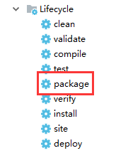

#### spring boot打包以及部署

##### 一、打包

`springboot`的打包方式有很多种。有打成`war`的，有打成`jar`的，也有直接提交到`github`，通过`jekins`进行打包部署的。这里主要介绍如何打成`jar`进行部署。不推荐用`war`，因为`springboot`适合前后端分离，打成`jar`进行部署更合适。

需要在`pom.xml`中增加主程序入口

```xml
<build>
    <plugins>
        <plugin>
            <groupId>org.springframework.boot</groupId>
            <artifactId>spring-boot-maven-plugin</artifactId>
            <configuration>
                <executable>true</executable>
            </configuration>
        </plugin>
    </plugins>
</build>
```

- 在idea工具中可视化工具打包，如图



- 通过命令行来打包

  > mvn clean package -Dmaven.test.skip=true

##### 二、部署

[官网文档部署说明](https://docs.spring.io/spring-boot/docs/2.0.5.RELEASE/reference/htmlsingle/#deployment-install)

按照这上面部署被坑惨了。。

下面整理下自己部署的`sh`脚本

1. XXX.sh，此`sh`放到和jar统一目录即可

~~~sh
#!/bin/sh
### BEGIN INIT INFO
# Provides:          lanwei
# Required-Start:    $local_fs $network
# Required-Stop:     $local_fs
# Default-Start:     2 3 4 5
# Default-Stop:      0 1 6
# Short-Description: XXX service
# Description:       XXX service
### END INIT INFO
echo "Starting...."
APP_NAME=$(echo $(basename $0) | sed -e 's/^[SK][0-9]*//' -e 's/\.sh$//')
APP_HOME=/usr/software/${APP_NAME}
#这里需要配置环境，dev test stg prd
APP_ENV="dev"
#配置jar
APP_JAR=${APP_HOME}/XXXX.jar
usage() {
    echo "Usage: sh ${APP_NAME} [start|stop|restart]"
    exit 1
}
##################################################
# Some utility functions
##################################################
findDirectory()
{
  local L OP=$1
  shift
  for L in "$@"; do
    [ "$OP" "$L" ] || continue
    printf %s "$L"
    break
  done
}
echo "APP_ENV   :   ${APP_ENV}"
echo "APP_HOME  :   ${APP_HOME}"
echo "APP_NAME  :   ${APP_NAME}"
echo "APP_JAR   :   ${APP_JAR}"
#####################################################
# Find a location for the pid file
#####################################################
if [ -z "$APP_RUN" ]
then
  APP_RUN=$(findDirectory -w /var/run /usr/var/run /tmp)
fi
#APP_RUN=/var/run
echo "APP_RUN   :   ${APP_RUN}"
#####################################################
# Find a pid
#####################################################
if [ -z "$APP_PID" ]
then
  APP_PID="$APP_RUN/${APP_NAME}.pid"
fi
echo "APP_PID   :   ${APP_PID}"
LOG=${APP_HOME}/logs/${APP_ENV}.log
ERROR_LOG=${APP_HOME}/logs/${APP_ENV}_err.log
case $1 in
    start)
        echo "Starting ${APP_NAME} ..."
        if [ ! -f $APP_PID ]; then
            cd ${APP_HOME}
            nohup java -jar $APP_JAR --spring.profiles.active=${APP_ENV} > $LOG 2> $ERROR_LOG &
                        echo $! > $APP_PID
            echo "$APP_NAME started ..."
        else
            echo "$APP_NAME is already running ..."
        fi
    ;;
    stop)
        if [ -f $APP_PID ]; then
            PID=$(cat $APP_PID);
                        echo "$APP_NAME PID is ${PID}"
            echo "$APP_NAME stoping ..."
            kill $PID;
            echo "$APP_NAME stopped ..."
            rm $APP_PID
        else
            echo "$APP_NAME is not running ..."
        fi
    ;;
    restart)
        if [ -f $APP_PID ]; then
            PID=$(cat $APP_PID);
                        echo "$APP_NAME PID is ${PID}"
            echo "$APP_NAME stopping ...";
            kill $PID;
            echo "$APP_NAME stopped ...";
            rm $APP_PID
            echo "$APP_NAME starting ..."
            cd ${APP_HOME}
            nohup java -jar $APP_JAR --spring.profiles.active=${APP_ENV} > $LOG 2> $ERROR_LOG &
                        echo $! > $APP_PID
            echo "$APP_NAME started ..."
        else
            echo "$APP_NAME is not running ..."
            echo "$APP_NAME starting ..."
                        cd ${APP_HOME}
            nohup java -jar $APP_JAR --spring.profiles.active=${APP_ENV} > $LOG 2> $ERROR_LOG &
                        echo $! > $APP_PID
            echo "$APP_NAME started ..."
        fi
    ;;
esac
~~~


2. 在`/etc/init.d/`下创建自己的服务名称文件这里比如`myapp.sh`

~~~sh
#!/bin/sh
#
# /etc/init.d/sms-web
# chkconfig: 345 63 37
# description: activemq servlet container.
# processname: activemq 5.14.1

# Source function library.
#. /etc/init.d/functions
# source networking configuration.
#. /etc/sysconfig/network

export JAVA_HOME=/usr/local/jdk1.8.0_144
export PATH=$JAVA_HOME/bin:$PATH
export MYAPP_WEB_HOME=/usr/software/myapp

case $1 in
    start)
        sh $MYAPP_WEB_HOME/myapp.sh start
    ;;
    stop)
        sh $MYAPP_WEB_HOME/myapp.sh stop
    ;;
    restart)
        sh $MYAPP_WEB_HOME/myapp.sh restart
    ;;

esac
exit 0

~~~

3. 在`/etc/init.d/`下 `chmod +x myapp.sh`赋权限
4. `chkconfig --list`查看服务列表，如果没有， 添加`chkconfig --add myapp`到服务中。
5. 设置开机启动`chkconfig myapp on`

